```mermaid
classDiagram
	%% 这段图表代ç ç”± AI 生æˆ
    class Swimmable {
        <<interface>>
        +void swim()
    }

    class Animal {
        <<abstract>>
        -String name
        +Animal(String name)
        +void eat()
        +void sleep()
        +void makeSound()*
    }

    Animal <|-- Dog
    Animal <|-- Cat
    Animal <|-- Duck

    Duck ..|> Swimmable
    
    class Dog {
        +void makeSound()
        +void fetch()
    }

    class Cat {
        +void makeSound()
        +void scratch()
    }

    class Duck {
        +void makeSound()
        +void swim()
    }
```

Mermaid 是一个开源的图表和可视化工具。借助 Mermaid，您可以在页面上插入流程图、类图等图表。

要启用 Mermaid 支持，需要先安装 `hexo-filter-mermaid-diagrams` 包：

```bash
npm install --save hexo-filter-mermaid-diagrams
# 如果你使用其它的包管理器，请自行搜索用法
```

之后在配置文件中启用。

```yaml blog/_config.stellaris.yml
plugins:
  mermaid:
    enabled: true
    per_page: false # 启用后无需在文章开头加 mermaid: true 即可启用
    js: https://cdn.jsdelivr.net/npm/mermaid@11.4.1/dist/mermaid.min.js
    # Available themes: default | dark | forest | neutral
    # 如果不填写将遵循博客颜色主题
    theme: neutral
```

在某页面的 front-matter 中，设置 `mermaid: true` 即可对该页面启用 Mermaid。

把图表代码写在 Markdown 代码块中即可。

效果如下：





